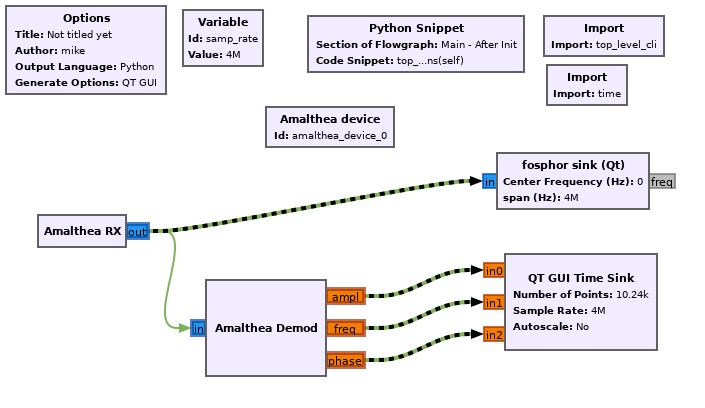

Getting started
===============

Installation
------------

Clone and install:

::

  git clone https://github.com/greatscottgadgets/amalthea
  cd amalthea
  pip3 install --user --editable '.'

Add custom block path to ~/.gnuradio/config.conf:

::

  [grc]
  local_blocks_path = /path/to/amalthea/amalthea/gnuradio/

 

Usage
-----

An example flowgraph is provided here: https://github.com/greatscottgadgets/amalthea/blob/master/amalthea/gnuradio/example/hybridsdr.grc

Block details
-------------

Device block
^^^^^^^^^^^^

The HybridSDR device block (`Amalthea device` in this example) represents the external FPGA device and would contain parameters for configuring it/connecting to it. It contains the top-level nMigen design, the callbacks for registering blocks/connections, and handles the host-side USB streaming when the flowgraph runs.

HybridSDR domain
^^^^^^^^^^^^^^^^

GNU Radio defines the concept of a `sample domain` and allows block inputs/outputs to be placed in a particular domain when they are defined. Here we define a custom `hybridsdr` domain for our FPGA-targeted blocks:

::

  id: hybridsdr
  label: HybridSDR
  color: "#81b35d"
  
  multiple_connections_per_input: false
  multiple_connections_per_output: true
  
  templates:
  -   type: [hybridsdr, hybridsdr]
      connect: self.amalthea_device.connect(("${ source.parent_block.name }", ${ source.key }), ("${ sink.parent_block.name }", ${ sink.key }))
  -   type: [hybridsdr, stream]
      connect: self.amalthea_device.connect_usb(("${ source.parent_block.name }", ${ source.key }), ${ make_port_sig(sink) })
  
This also defines how connections should be made between different domains:
 - Connections between two `hybridsdr` ports are registered with the `Device block`.
 - Connections between `hybridsdr` and `stream` (GNU Radio's standard sample domain) represent a crossing from the FPGA device to the host PC, and have a special callback that will create a seamless USB stream during elaboration.

Gateware blocks
^^^^^^^^^^^^^^^

These are blocks that represent functionality targeted at the FPGA. Here, `Amalthea RX` represents the radio receiver on the Amalthea device and is a source of samples. `Amalthea Demod` represents an nMigen module implementing amplitude, frequency, and phase demodulation.

Blocks are implemented as standard nMigen modules, using nMigen/LUNA stream interfaces for input and output. Blocks are defined and exposed to GNU Radio Companion using standard GNU Radio YAML configuration files. This configuration includes a template for instantiation which registers the block with the `Device block`:

::

  id: amalthea_demod
  label: Amalthea Demod
  category: '[Amalthea]'
  
  templates:
    imports: |-
        import amalthea
    make: |
        self.amalthea_device.add_block("${id}", amalthea.gateware.demod.CORDICDemod(13))
  

Block inputs and outputs are created within the `hybridsdr` domain:

::

  inputs:
  - domain: hybridsdr
    dtype: complex
    vlen: 1
  
  outputs:
  - domain: hybridsdr
    label: ampl
    dtype: float
    optional: true
  - domain: hybridsdr
    label: freq
    dtype: float
    optional: true
  - domain: hybridsdr
    label: phase
    dtype: float
    optional: true
  
Extras
^^^^^^

GNU Radio doesn't currently have a way for the device block to run code just before the flowgraph starts, so the gateware build/program step is invoked using a `Python Snippet` block in this example:

::

  top_level_cli(self.amalthea_device)
  time.sleep(10)
  self.amalthea_device.finalize_usb_connections(self)

This builds the gatware and programs the Amalthea device, waits for it to start & enumerate, then creates the host-side USB connections to the `stream`-domain blocks.

Other buses
-----------

By default, HybridSDR designs use nMigen/LUNA stream interfaces between blocks. However, by using the same techniques above to design custom sample domains & connection behaviour, other bus standards can be supported and interconnected.

An example block implementing a pipelined Wishbone interface is included. The domain definition includes a template for inserting an adapter module so that it can interface with the LUNA USB stream interface:

::

  templates:
  -   type: [wishbone, stream]
      connect: |-
          self.${source.parent_block.name}_stream = amalthea.gateware.wishbone_example.StreamAdapter(self.${source.parent_block.name})
          self.amalthea_device.add_block("${source.parent_block.name}_stream", self.${source.parent_block.name}_stream)
          self.amalthea_device.connect_usb(("${ source.parent_block.name }_stream", ${ source.key }), ${ make_port_sig(sink) })
  
