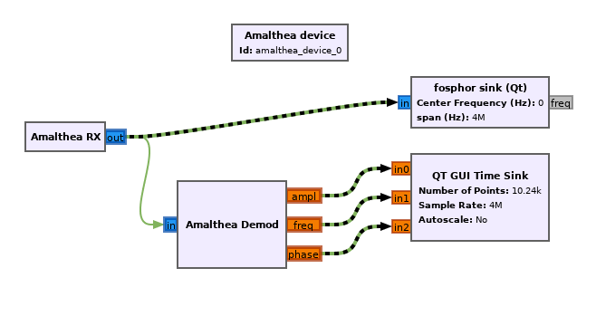

Introduction
============

HybridSDR is a toolkit for building software-defined radio systems containing a mixture of software running on a general-purpose computer and gateware running an an FPGA. It allows the user to connect signal processing blocks graphically. Then, at runtime, the gateware design is assembled using the flexibility of `Amaranth <https://github.com/amaranth-lang/amaranth>`_. 

Crossings between the gateware and software domains are handled seamlessly. At runtime a custom USB device is built in gateware using `LUNA <https://github.com/greatscottgadgets/luna>`_.

The current proof-of-concept is provided as an out-of-tree module for `GNU Radio <https://www.gnuradio.org>`_, which includes a graphical interface to place & connect signal processing blocks and a large range of existing blocks to use. It targets the ECP5 FPGA on the `Amalthea <https://github.com/greatscottgadgets/amalthea/>`_ open-source radio platform.

Above is a screenshot from GNU Radio Companion, showing how the HybridSDR blocks can be used. Green lines represent connections in the gateware domain - these connections and blocks are built into a gateware bitstream at runtime. Green/black striped lines represent seamless connections across USB streams.
